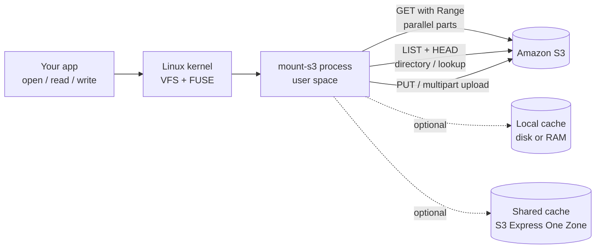
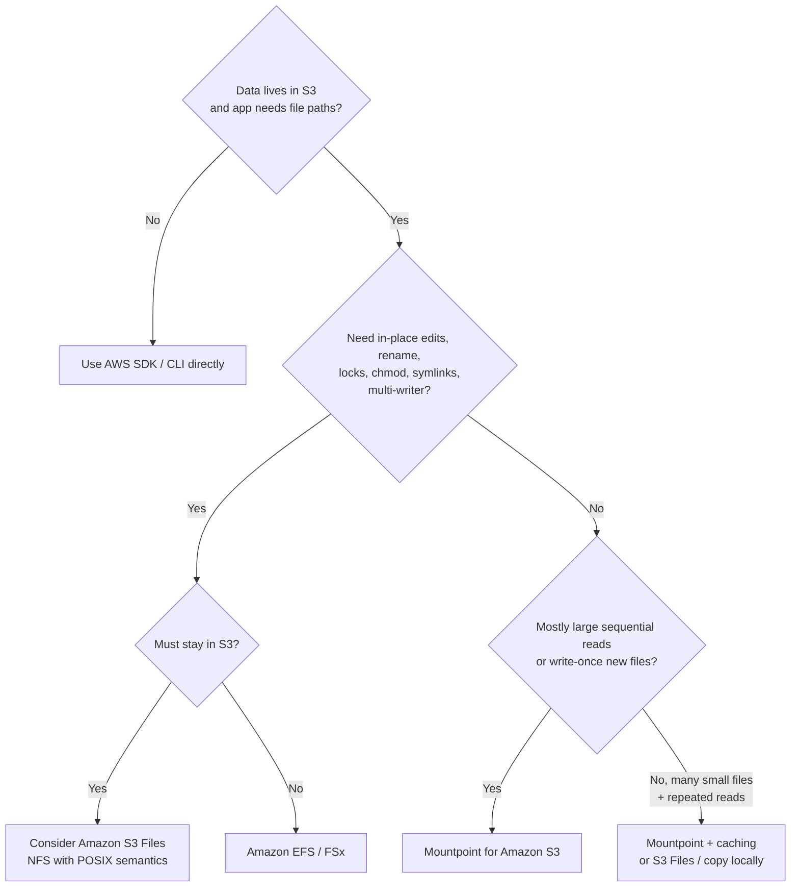
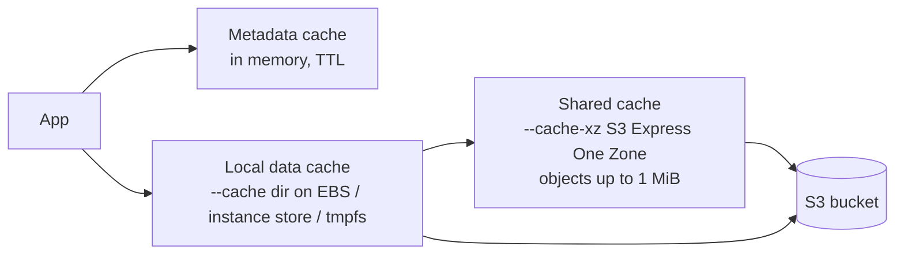
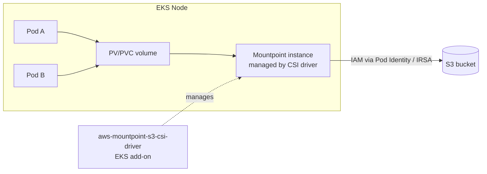

# Mountpoint for Amazon S3 — Scenario-First Deep Dive

> **Scope check:** "S3 mount point" here means **Mountpoint for Amazon S3** (the `mount-s3` command, AWS's open-source file client), plus its Kubernetes/EKS CSI driver. It is *not* an S3 Access Point, and it is *not* third-party tools like s3fs or goofys.
>
> **Last verified:** 29 Sep 2026 against AWS/awslabs docs (Mountpoint v1.22.x docs, CSI driver v2.x docs). Section 12 lists what was verified and what was not.

---

## Table of contents

1. [Start with a scenario](#1-start-with-a-scenario)
2. [What is Mountpoint?](#2-what-is-mountpoint)
3. [How it works (diagram)](#3-how-it-works)
4. [Why use it?](#4-why-use-it)
5. [When to use it — and when NOT to](#5-when-to-use-it--and-when-not-to)
6. [Hands-on: install, mount, IAM](#6-hands-on-install-mount-iam)
7. [Reads, writes, and consistency (the rules you must know)](#7-reads-writes-and-consistency)
8. [Caching](#8-caching)
9. [Billing variables](#9-billing-variables)
10. [Disadvantages and limitations](#10-disadvantages-and-limitations)
11. [Best practices checklist](#11-best-practices-checklist)
12. [Running it on EKS (CSI driver)](#12-running-it-on-eks-csi-driver)
13. [Alternatives: EFS, FSx, S3 Files, SDK](#13-alternatives)
14. [Troubleshooting cheat sheet](#14-troubleshooting-cheat-sheet)
15. [Verification log](#15-verification-log)

---

## 1. Start with a scenario

### Scenario A — "My script only understands folders"

Your data team has a Python training script:

```python
for path in glob.glob("/data/images/*.jpg"):
    img = open(path, "rb").read()
```

The images (2 TB) live in S3. Today someone runs `aws s3 sync` to copy 2 TB onto every EC2 instance before training starts. That means:

- 30+ minutes of waiting before training begins
- 2 TB of EBS storage paid for on every instance
- Copies go stale when the dataset changes

**With Mountpoint:**

```bash
mount-s3 my-training-bucket /data
```

`/data/images/*.jpg` now *looks* like a local folder, but every `open()`/`read()` is translated into S3 requests behind the scenes. Training starts immediately, no copy, no extra disk.

### Scenario B — "It broke my app" (the failure case)

Someone else mounts the same bucket and points a tool at it that does this:

```bash
echo "new line" >> /data/config.txt     # append to an existing file
mv /data/a.csv /data/b.csv               # rename
chmod 600 /data/secret.pem               # change permissions
```

All three **fail** on a general-purpose bucket. Mountpoint is not a full file system. Understanding *why* is the whole point of this guide, and it's covered in [Section 10](#10-disadvantages-and-limitations).

### Scenario C — "Pods need shared read-only reference data"

50 pods on EKS need the same 200 GB model/reference dataset. Baking it into the image is slow; EFS is expensive for cold data. Mountpoint's CSI driver mounts the bucket into each pod as a volume. See [Section 12](#12-running-it-on-eks-csi-driver).

---

## 2. What is Mountpoint?

**Mountpoint for Amazon S3** is a file client that mounts an S3 bucket as a local directory on Linux. Your application uses normal file calls (`open`, `read`, `write`), and Mountpoint translates them into S3 API calls.

Key facts (from AWS docs):

- It is **optimized for high read throughput on large objects**, possibly from many clients at once, and for **writing new objects sequentially from a single client at a time**.
- It does **not** implement all of POSIX. Anything that cannot be done efficiently with S3's object APIs is not supported.
- It is **open source** (`awslabs/mountpoint-s3`, written in Rust) and generally available.
- **No extra charge** for Mountpoint itself; you pay for the underlying S3 usage.
- Works on EC2, ECS, and EKS. On EKS you use the Mountpoint **CSI driver**.

**Analogy:** Mountpoint is a translator at a counter. You (the app) speak "file". S3 speaks "objects over HTTPS". The translator handles the language, but cannot make S3 do things it fundamentally can't (like editing the middle of an object).

---

## 3. How it works



**Directories are inferred.** S3 is flat; Mountpoint treats `/` in object keys as folder separators:

| S3 object key | What you see |
|---|---|
| `colors/blue/cat.jpg` | `colors/blue/cat.jpg` (file inside 2 folders) |
| `colors/red/dog.jpg` | `colors/red/dog.jpg` |
| `colors/list.txt` | `colors/list.txt` |

**Odd keys are hidden:**

- Key `blue` **and** `blue/image.jpg` both exist → only the **directory** `blue` is visible; the file `blue` is shadowed.
- Keys ending with `/` (as objects) are shown as directories, not files.
- Keys containing `.` or `..` path segments, or null bytes, are inaccessible.
- Windows-style `\` separators are not supported.

**Reads are parallelised.** For sequential reads, Mountpoint issues multiple concurrent ranged GETs (default part size 8 MiB) to reach high throughput. It also prefetches data ahead of your reads.

---

## 4. Why use it?

| Problem | How Mountpoint helps |
|---|---|
| Tool only reads local files, data is in S3 | Present S3 as a folder, no code change |
| Copying big datasets before every job | Skip the copy; read on demand |
| Paying for big disks just to stage data | Use S3 as the source of truth |
| Many instances need the same data | Each mounts the same bucket; S3 scales throughput |
| Need high read throughput | Parallel ranged GETs; up to network bandwidth of the instance |
| Prefer IAM-based access | Uses the normal AWS credential chain and honours bucket policies |

The honest counterweight: it helps only where your access pattern matches what S3 is good at (big objects, sequential reads, write-once). See next section.

---

## 5. When to use it — and when NOT to

### Good fit ✅

- ML/AI training and inference reading large datasets and checkpoints
- Big-data / analytics jobs that read large files
- Media processing (video, images, genomics) reading large files
- Batch jobs that **write new output files once, sequentially**
- Read-heavy shared reference data on many hosts (with caching)
- Legacy tools that need a path but only read/create files

### Poor fit ❌

- Databases (SQLite, Postgres data dir), anything that updates files in place
- Editing files with `vim`, appending with `>>`, log files kept open and appended (on standard S3)
- Apps that rename/move files or directories a lot
- Apps that need `chmod`/`chown`, symlinks, hard links, file locks, xattrs
- Multiple writers to the same file
- Very "chatty" metadata workloads (millions of tiny files, constant `ls`/`stat`) without caching (cost + latency)
- Anything needing full POSIX (use EFS / FSx or S3 Files instead)

### Decision flow



---

## 6. Hands-on: install, mount, IAM

### Install (Amazon Linux example)

AWS's own user-data example downloads the RPM:

```bash
curl https://s3.amazonaws.com/mountpoint-s3-release/latest/x86_64/mount-s3.rpm -o /tmp/mount-s3.rpm
sudo yum install -y /tmp/mount-s3.rpm
```

(For Graviton/arm64 use the arm64 RPM path; see the official install docs for other OSes.)

### Mount

```bash
mkdir -p /mnt/data
mount-s3 my-bucket /mnt/data                       # whole bucket
mount-s3 my-bucket /mnt/data --prefix team-a/      # only one prefix (must end with /)
mount-s3 my-bucket /mnt/data --read-only           # forbid all writes
mount-s3 my-bucket /mnt/data --allow-delete        # opt in to deletes
mount-s3 my-bucket /mnt/data --allow-overwrite     # opt in to overwriting existing objects
```

Unmount with `umount /mnt/data`.

### Defaults worth memorising

| Behaviour | Default | Flag to change |
|---|---|---|
| Create new files | Allowed | `--read-only` to block |
| Delete existing files | **Blocked** | `--allow-delete` |
| Overwrite existing files | **Blocked** | `--allow-overwrite` (needs `O_TRUNC`) |
| Who can access the mount | Only the user who mounted (even root is blocked) | `--allow-other`, `--allow-root` (may need `user_allow_other` in `/etc/fuse.conf`) |
| File / dir mode | `0644` / `0755` | `--file-mode`, `--dir-mode` |
| Owner | User who mounted | `--uid`, `--gid` |
| Content-Type of new objects | `binary/octet-stream` | `--infer-content-type` |
| Read/write part size | 8 MiB | `--read-part-size`, `--write-part-size` |
| Concurrent operations | 16 | `--max-threads` |
| Throughput target | Instance bandwidth (EC2) or 10 Gbps elsewhere | `--maximum-throughput-gbps` |

### Least-privilege IAM (general purpose bucket, full access)

From the official docs (replace the bucket name):

```json
{
  "Version": "2012-10-17",
  "Statement": [
    {
      "Sid": "MountpointFullBucketAccess",
      "Effect": "Allow",
      "Action": ["s3:ListBucket"],
      "Resource": ["arn:aws:s3:::amzn-s3-demo-bucket"]
    },
    {
      "Sid": "MountpointFullObjectAccess",
      "Effect": "Allow",
      "Action": [
        "s3:GetObject",
        "s3:PutObject",
        "s3:AbortMultipartUpload",
        "s3:DeleteObject"
      ],
      "Resource": ["arn:aws:s3:::amzn-s3-demo-bucket/*"]
    }
  ]
}
```

- **Read-only mount:** you only need `s3:ListBucket` + `s3:GetObject`.
- **Writing** needs `s3:PutObject` **and** `s3:AbortMultipartUpload`. **Deleting** needs `s3:DeleteObject`.
- If you mount only a prefix, scope `GetObject`/`PutObject` etc. via `Resource`, but for `s3:ListBucket` use the `s3:prefix` condition key.
- **SSE-KMS:** reading needs `kms:Decrypt`; writing needs `kms:Decrypt` + `kms:GenerateDataKey`.
- **Directory buckets (S3 Express One Zone):** allow `s3express:CreateSession` instead of `s3:*` object actions.
- Prefer **short-term credentials** (EC2 instance profile, ECS task role, assumed role). Mountpoint does not support IAM Identity Center (SSO) authentication.

### Auto-mount at boot (`/etc/fstab`, Mountpoint v1.18+)

```
s3://my-bucket/my-prefix/ /mnt/mountpoint mount-s3 _netdev,nosuid,nodev,nofail,rw 0 0
```

- `_netdev`, `nosuid`, `nodev` are **required**; without them Mountpoint won't start.
- Always add `nofail` so a bad entry can't block boot.
- fstab mounts run as **root**, so credentials must be available at boot (instance profile via IMDS is recommended). Add `allow-other` if non-root users need access.
- Mountpoint flags go in the options field as `key=value` (e.g. `allow-delete,uid=7,region=ap-south-1`).
- Back up fstab first; a broken fstab can prevent boot.

---

## 7. Reads, writes, and consistency

### 7.1 What works

| Operation | Supported? | Notes |
|---|---|---|
| Sequential read | ✅ | Fastest path; parallel ranged GETs |
| Random read / seek | ✅ | Works; slower than sequential |
| Many readers on one file | ✅ | Allowed concurrently |
| Create **new** file | ✅ | Must write sequentially from offset 0 |
| Overwrite existing file | ⚠️ Opt-in | `--allow-overwrite` and open with `O_TRUNC` |
| Append to existing file | ⚠️ Only S3 Express One Zone | `--incremental-upload` flag |
| Delete file | ⚠️ Opt-in | `--allow-delete`; deletes the S3 object **immediately** |
| Rename file | ⚠️ Only S3 Express One Zone (in AZ directory buckets) | Not on general purpose buckets |
| Rename directory | ❌ | Not supported on any bucket type |
| `mkdir` | ⚠️ Local only | Creates nothing in S3 until a file is written inside |
| `rmdir` | ⚠️ | Only empty dirs created locally by `mkdir` |
| `chmod`, `chown` | ❌ | Fails |
| Symlinks / hard links | ❌ | Fails |
| Extended attributes | ❌ | Fails |
| File locks (`lockf`) | ❌ | Fails |
| `fallocate` | ❌ | Fails |

> Design principle from the docs: Mountpoint would rather **fail loudly (IO error)** than pretend to support something it can't persist.

### 7.2 Write path (diagram)

```mermaid
sequenceDiagram
    participant App
    participant MP as mount-s3
    participant S3 as Amazon S3
    App->>MP: open(new-file) for write
    App->>MP: write(chunk 1..N) sequential only
    MP->>S3: multipart upload parts (default 8 MiB each), starts on first write
    App->>MP: fsync() (optional)
    MP->>S3: finish upload; no more writes allowed to this handle
    App->>MP: close()
    MP->>S3: complete upload
    Note over S3: Object becomes visible to other clients only after close/fsync succeeds
```

Things to remember:

- Writes must start at offset 0 and be **strictly sequential**. Seeking then writing fails.
- The upload **starts on the first `write` and cannot be cancelled.**
- A file being written **cannot be read** until it is closed.
- Call **`fsync` before `close`** if you must be sure the object reached S3, and check its return value. After `fsync`, you cannot write more to that handle (except in incremental-upload mode on Express One Zone).
- A file handle is either read **or** write for its lifetime, never both, even if opened `O_RDWR`.
- **Max object size for writes:** default 10,000 parts × 8 MiB = **~78.1 GiB (80,000 MiB)**. Raise `--write-part-size` for bigger objects (S3 maximum object size 48.8 TiB).
- Number of files open for writing at once is capped (derived from `--memory-target` and `--write-part-size`); beyond it, `open()` for write returns `ENOMEM`.

### 7.3 Consistency (default, no caching)

- S3 itself gives strong read-after-write consistency, and Mountpoint keeps that: new objects created by *any* client are visible immediately; directory listings are never stale.
- If another client **modifies or deletes** an object you already accessed, `stat` metadata may be stale for up to **1 second**.
- If you have a file open and another client replaces the object, your reads return either old data or an error, **never corrupt or mixed data**. Re-open to see new data.
- Two Mountpoint mounts (or any two clients) writing the **same key** are **not coordinated**. Don't do it.

### 7.4 Storage class gotchas

- You **cannot read** objects in **Glacier Flexible Retrieval**, **Glacier Deep Archive**, or the Archive/Deep Archive tiers of Intelligent-Tiering unless you **restore** them first.
- Instant-retrieval classes (Standard, Standard-IA, Glacier Instant Retrieval, etc.) are readable.
- You can **write** new objects into a chosen class with `--storage-class` (e.g. `STANDARD_IA`, `INTELLIGENT_TIERING`, `GLACIER_IR`, `GLACIER`, `DEEP_ARCHIVE`).
- Directory buckets use the `EXPRESS_ONEZONE` class; you pick it by mounting a directory bucket name.

---

## 8. Caching

Caching is **opt-in** and it trades consistency for lower cost and latency.



| Cache | Flag | Use when | Watch out |
|---|---|---|---|
| **Metadata** | `--metadata-ttl <seconds \| indefinite \| minimal>` | Repeated `stat`/lookups; dataset rarely changes | Stale metadata; also caches "file does not exist" until TTL expires |
| **Local data** | `--cache <dir>` | Same instance re-reads the same data; you have spare disk/RAM | Stores **unencrypted** object content on local disk; lock down the directory (`chmod 0700`) |
| **Shared data** | `--cache-xz <directory-bucket>` | Many instances re-read **small objects (≤1 MiB)**; or dataset > local disk | You pay for S3 Express storage + requests; Mountpoint **never deletes** cached objects, so set a lifecycle expiry; anyone with access to the cache bucket can read the cached data |
| **Both** | `--cache` + `--cache-xz` | Spare local space *and* multi-instance sharing | Same cautions |

Details:

- Enabling a local or shared cache also turns on a metadata cache with a **default TTL of 60 s**. Without any cache, the metadata TTL preset is `minimal`.
- `--metadata-ttl indefinite` = best cost/perf when the bucket is effectively immutable. `minimal` = freshest.
- Local cache size: by default Mountpoint keeps at least 5% of the filesystem free and evicts least-recently-used data. Override with `--max-cache-size <MiB>`.
- Local cache directory is **wiped at mount and at exit**, and **cannot be shared** between Mountpoint processes. Use a unique cache dir per process.
- To force a fresh read of one file despite caching, open it with `O_DIRECT`.
- The cache never affects writes.
- RAM caching: mount a `tmpfs` (RAM disk) and point `--cache` at it.
- Shared cache: keep compute in the **same AZ** as the directory bucket, same Region and same AWS account as the mounted bucket. Use a **dedicated** directory bucket and give access **only** to Mountpoint clients (write access enables cache poisoning).

---

## 9. Billing variables

**Mountpoint itself is free.** You pay normal S3 (and surrounding AWS) costs for whatever Mountpoint does on your behalf. The trap: file-style habits (`ls`, `find`, `stat`, small reads) turn into **many S3 requests**.

### 9.1 The cost levers

| # | Variable | What drives it | Notes |
|---|---|---|---|
| 1 | **S3 storage** | GB-month × storage class | Same as any S3 use |
| 2 | **GET-class requests** | File reads. Each ranged GET = 1 request | Default 8 MiB parts → a 1 GiB read ≈ 128 GETs. Bigger `--read-part-size` reduces request count but can reduce throughput |
| 3 | **HEAD / lookup requests** | Every path lookup | Mountpoint sends concurrent `HeadObject` and `ListObjectsV2` during lookups |
| 4 | **LIST requests** | `ls`, `find`, directory walks, lookups | LIST is billed at the **PUT/COPY/POST rate**, which is much higher than GET (see 9.2) |
| 5 | **PUT requests** | File writes (multipart parts count as requests) | Each 8 MiB part = 1 request; bigger `--write-part-size` = fewer requests |
| 6 | **Append (Express One Zone)** | Each successful append is billed as a PutObject | Frequent small appends get expensive |
| 7 | **Data transfer** | Cross-Region and Internet egress | Same-Region S3 ↔ EC2 transfer is generally free. Cross-Region isn't |
| 8 | **KMS** | SSE-KMS encrypt/decrypt calls | Each request may involve KMS; consider S3 Bucket Keys (general S3 guidance) |
| 9 | **Shared cache** | S3 Express One Zone storage + requests | You pay for cached data; Mountpoint never expires it; add a lifecycle rule |
| 10 | **Local cache infra** | EBS volume / instance store / RAM | Cheaper than repeated S3 requests only if data is re-read |
| 11 | **Network path** | NAT Gateway data processing vs. S3 gateway endpoint | General AWS knowledge (not Mountpoint-specific): use an S3 **gateway VPC endpoint** so S3 traffic doesn't go through NAT. Mountpoint automatically uses gateway endpoints in your VPC |
| 12 | **Requester Pays** | If the bucket is Requester Pays, **you** pay | Must pass `--requester-pays` |
| 13 | **Retrieval fees** | IA / Glacier classes | Reading from Standard-IA etc. adds per-GB retrieval charges; small objects have minimum billable sizes |
| 14 | **Restores** | Glacier Flexible / Deep Archive | Must restore before Mountpoint can read |

### 9.2 List prices to sanity-check

Reference **S3 Standard, US East (N. Virginia)** rates quoted by AWS re:Post and third-party pricing guides at the time of writing:

| Request type | Price per 1,000 |
|---|---|
| PUT / COPY / POST / **LIST** | $0.005 |
| GET / SELECT | $0.0004 |

Your Region (e.g. `ap-south-1`) and storage class will differ. **Always confirm on the [S3 pricing page](https://aws.amazon.com/s3/pricing/).** Also note: HEAD requests fall in the GET-and-other class (general S3 pricing knowledge; verify on the pricing page).

### 9.3 Worked example: why metadata caching matters (illustrative)

Workload: 1,000,000 small files, read fully once per epoch, 10 epochs, no caching.

Worst-case assumption: every lookup triggers 1 HEAD + 1 LIST, then 1 GET per file.

| Per epoch | Requests | Cost @ example rates |
|---|---|---|
| HEAD | 1,000,000 | 1,000 × $0.0004 = **$0.40** |
| LIST | 1,000,000 | 1,000 × $0.005 = **$5.00** |
| GET | 1,000,000 | 1,000 × $0.0004 = **$0.40** |
| **Total / epoch** | | **≈ $5.80** |
| **10 epochs** | | **≈ $58** |

With `--cache` (local data cache) + `--metadata-ttl indefinite`, epoch 1 costs about the same, but epochs 2–10 mostly hit the cache → total closer to **~$6** plus cache disk cost.

> This is an **upper-bound illustration**, not a measurement. Real request counts depend on directory layout, kernel caching, and Mountpoint version. **Measure your own workload** with S3 request metrics (CloudWatch) or S3 server access logs, and/or Mountpoint's OTLP metrics (`--otlp-endpoint`).

### 9.4 Cost-control cheatsheet

- Turn on `--cache` for re-read workloads; set `--metadata-ttl` to match how often data changes.
- Mount a **prefix**, not the whole bucket, so listings are smaller.
- Prefer **fewer, larger files** (or archives/shards like WebDataset/Parquet) over millions of tiny ones.
- Avoid `find /mnt/data` / recursive `ls` in scripts and health checks.
- Use an **S3 gateway endpoint**.
- Put a **lifecycle rule** on any shared-cache directory bucket.
- Enable a lifecycle rule to abort incomplete multipart uploads (general S3 best practice, since interrupted writes can leave billed parts behind).

---

## 10. Disadvantages and limitations

| # | Limitation | Consequence | Mitigation |
|---|---|---|---|
| 1 | **Not POSIX-complete** | No chmod/chown, symlinks, hard links, xattrs, locks, fallocate | Use EFS/FSx/S3 Files for those apps |
| 2 | **Sequential writes only, no in-place edit** | `vim`, `sed -i`, `>>`, SQLite, git operations, many installers break | Write to local disk, then copy to the mount |
| 3 | **No rename on general purpose buckets; no directory rename anywhere** | `mv` fails; build tools that rename temp files fail | Use Express One Zone directory buckets for file rename, or write final names directly |
| 4 | **Overwrite/delete disabled by default** | "Operation not permitted" errors | Opt in with flags; **turn on bucket versioning** first (AWS recommends this with `--allow-delete`) |
| 5 | **Delete is immediate and permanent-ish** | Readers on other hosts start failing | Versioning + IAM scoping |
| 6 | **Written files invisible until close/fsync** | Can't "tail" a file being written | Don't use for live logs |
| 7 | **Single writer per file, no multi-mount coordination** | Silent last-writer-wins in S3 | Partition writers by key/prefix |
| 8 | **Latency** | Every cold operation is a network call; small-file workloads are slow | Caching, bigger files, or S3 Files |
| 9 | **Request costs for metadata-heavy access** | Surprise LIST/HEAD bills | See Section 9 |
| 10 | **Memory usage** | Prefetch windows scale with available memory (up to 2 GiB per file handle by default) | Watch RSS on many parallel readers; set memory-related limits in containers |
| 11 | **Caching relaxes consistency** | Stale metadata; missing-file results cached | Choose TTL deliberately; `O_DIRECT` for critical reads |
| 12 | **Local cache stores plaintext** | Data-at-rest exposure on instance disk | Lock down dir, use encrypted EBS |
| 13 | **Glacier objects unreadable until restored** | Read errors | Restore first |
| 14 | **Object-key mismatches** | Some keys are invisible (`a` vs `a/b`, `.`/`..` segments, trailing `/` objects) | Clean key naming |
| 15 | **Max write size ~78 GiB by default** | Large-file writes fail with out-of-space | Raise `--write-part-size` |
| 16 | **Limited data-integrity guarantees over POSIX** | `read`/`write` have no built-in checksum; AWS recommends the SDK with end-to-end checksums if integrity is critical | Use SDK for critical pipelines |
| 17 | **Auth limits** | No IAM Identity Center (SSO); no SSE-C reads; no client-side encryption (S3 Encryption Client) | Use IAM roles; SSE-S3/SSE-KMS/DSSE-KMS |
| 18 | **Transient errors surface as I/O errors** | Retries (up to 10 attempts by default) are exhausted → `EIO` | Retry at the app level; fsync + check errors on writes |
| 19 | **Linux/FUSE dependency** | Needs FUSE and the right mount privileges (`--allow-other` needs `/etc/fuse.conf` edit) | Plan for containers/EKS via the CSI driver |
| 20 | **Single-process throughput cap** | Shares one network budget (`--maximum-throughput-gbps`) and 16 default concurrent ops | Tune `--max-threads`; split bandwidth across multiple mounts |

---

## 11. Best practices checklist

**Design**
- [ ] Use it for **large, sequentially-read files** and **write-once outputs**. If you need edit-in-place, choose another service.
- [ ] Prefer few large files over many small ones. If you have many small files, plan caching from day one.
- [ ] Give each writer its own key/prefix; never have two writers on one key.
- [ ] Keep keys clean (no `file` + `file/child` collisions).

**Security**
- [ ] Use **IAM roles / short-term credentials**; no long-term keys on disks.
- [ ] Least privilege: read-only jobs get only `ListBucket` + `GetObject`; add `--read-only` too.
- [ ] Mount only the **prefix** the workload needs.
- [ ] Don't enable `--allow-other` unless needed; when you do, IAM still applies.
- [ ] Turn on **Bucket Versioning** before enabling `--allow-delete` / `--allow-overwrite`.
- [ ] If caching locally: restrict the cache directory and use encrypted volumes.
- [ ] Shared cache: dedicated directory bucket, same account, access only for Mountpoint clients.
- [ ] Consider `--expected-bucket-owner <account-id>` to guard against mounting the wrong account's bucket.

**Performance**
- [ ] Run in the **same Region** as the bucket; use a **gateway VPC endpoint**.
- [ ] Pick instances with enough network bandwidth; Mountpoint scales to available bandwidth by default.
- [ ] Sequential reads beat random reads; read files front-to-back when possible.
- [ ] Tune `--max-threads` only if you have >16 concurrent file operations.
- [ ] Leave part sizes at 8 MiB unless you have a measured reason (raise `--write-part-size` for giant objects).
- [ ] Multiple Mountpoint processes on one host: split bandwidth with `--maximum-throughput-gbps` and give each a **separate cache directory**.

**Reliability / operations**
- [ ] **`fsync` then `close`, and check both return codes**, for any write you can't afford to lose.
- [ ] Handle `EIO` and timeouts in your app (network storage can fail transiently).
- [ ] fstab: always `_netdev,nosuid,nodev,nofail`; validate with `systemctl` and keep a backup.
- [ ] Turn on logging (syslog by default) and export metrics via `--otlp-endpoint` to CloudWatch Agent or another collector.
- [ ] Add a lifecycle rule to abort incomplete multipart uploads.
- [ ] Pin and test Mountpoint versions; read release notes (behaviour has evolved, e.g. append/rename for Express One Zone came in later releases).

**Cost**
- [ ] Measure request counts before and after enabling caching.
- [ ] Avoid recursive listings in cron/health checks.
- [ ] Set a lifecycle expiry on the shared-cache bucket.

---

## 12. Running it on EKS (CSI driver)



Verified facts about the **Mountpoint for Amazon S3 CSI driver**:

- Available as an **EKS add-on** (recommended for EKS) or via **Helm**. Installing straight from a GitHub branch is not supported.
- Provisioning: **static provisioning only**. You create a `PersistentVolume` that points to an *existing* bucket, then a `PersistentVolumeClaim`. There is no StorageClass / dynamic bucket creation.
- Driver name in the PV: `s3.csi.aws.com`.
- **v2** adds: Mountpoint **Pod sharing** (multiple workloads can share one Mountpoint instance), **EKS Pod Identity** support, SELinux-enabled environments (e.g. ROSA), and simplified caching (an `emptyDir` or generic ephemeral volume as the local cache).
- Compatible with Kubernetes 1.31+ (current README), x86-64 and arm64.
- Credentials: **EKS Pod Identity** is the recommended way for either driver-level or pod-level credentials; IRSA also works. Pod-level credentials only support Pod Identity and IRSA.
- Mount options go in the PV's `mountOptions` (same Mountpoint options as CLI, e.g. `allow-delete`, `region=...`).

Example static PV/PVC (shape based on the driver's static-provisioning example; **check `examples/kubernetes/static_provisioning` in the repo for your driver version before using**):

```yaml
apiVersion: v1
kind: PersistentVolume
metadata:
  name: s3-pv
spec:
  capacity:
    storage: 1200Gi          # required by Kubernetes but ignored by the driver
  accessModes:
    - ReadWriteMany
  mountOptions:
    - region=ap-south-1
    - prefix=team-a/
    - read-only              # remove if writes are needed
  csi:
    driver: s3.csi.aws.com
    volumeHandle: s3-csi-driver-volume   # any unique id
    volumeAttributes:
      bucketName: my-bucket
---
apiVersion: v1
kind: PersistentVolumeClaim
metadata:
  name: s3-pvc
spec:
  accessModes:
    - ReadWriteMany
  storageClassName: ""       # empty = static provisioning
  resources:
    requests:
      storage: 1200Gi
  volumeName: s3-pv
```

EKS-specific cautions:

- Every limitation in Section 10 still applies inside pods (no rename, sequential writes only, etc.). This is the #1 source of "my pod crashes on S3 volume" tickets.
- Don't use it for databases or stateful apps needing POSIX; use EBS/EFS for those.
- Watch pod memory limits: the Mountpoint process consumes memory (prefetch/caching).
- Scope IAM per workload with Pod Identity/IRSA rather than giving the node role broad S3 access.

---

## 13. Alternatives

| Need | Better option | Why |
|---|---|---|
| Large sequential reads / write-once from Linux | **Mountpoint** | Cheap, fast, simple |
| Full POSIX, shared, low latency, Linux | **Amazon EFS** | Real NFS file system |
| Windows / SMB, or Lustre HPC | **Amazon FSx** | Purpose-built |
| Same S3 data as files **and** objects, with POSIX semantics | **Amazon S3 Files** *(launched April 2026)* | NFS 4.1/4.2 view of a bucket; supports rename, locks, permissions. Has its own pricing on the "active" data layer. Details below are from AWS docs plus press/third-party write-ups; check the official docs before deciding |
| Data integrity critical, custom code | **AWS SDK / CLI** | End-to-end checksums, full API control |
| Bulk one-time copy | `aws s3 sync` / `cp` | Simpler when you truly need local data |

S3 Files caveat worth knowing (third-party sources, verify): writes may be batched and synced back to S3 on a delay (reported as roughly 60 s), so an S3 API reader might not see a just-written file immediately. Mountpoint's model is simpler: object appears when the write is closed/fsynced.

---

## 14. Troubleshooting cheat sheet

| Symptom | Likely cause | Fix |
|---|---|---|
| `Operation not permitted` on `rm` | Deletes disabled | `--allow-delete` (enable versioning first) |
| `Operation not permitted` / error on overwrite | Overwrite disabled or missing `O_TRUNC` | `--allow-overwrite`; open with truncate (`>` not `>>`) |
| Error on `>>` append | Appends only on Express One Zone with `--incremental-upload` | Write full file, or use Express One Zone |
| `mv` fails | No rename on general purpose buckets | Write final name directly |
| `EPERM` opening a file | Another handle is reading/writing it in an incompatible mode | Close other handles |
| `ENOMEM` on open for write | Too many files open for writing at once | Close handles; adjust memory/part size |
| `EIO` / timeouts | S3 throttling (503 SlowDown) after retries, or network problems | Reduce request rate, spread keys, retry in app |
| Other user / root can't see the mount | FUSE default restricts to mounting user | `--allow-other` / `--allow-root` (+ `user_allow_other`) |
| Mount fails "Access Denied" / "No Such Bucket" | Region auto-detection failed or missing permissions / Requester Pays | `--region`, check IAM, `--requester-pays` |
| File exists in S3 but not visible | Key conflicts (file + dir same name), invalid path segments | Fix key layout |
| Stale data with cache | Metadata TTL | Lower `--metadata-ttl`, use `O_DIRECT` |
| Can't read an object | Glacier Flexible/Deep Archive not restored | Restore it |
| Boot hangs after fstab edit | Missing `nofail` or bad options | Use `nofail`; fix fstab via recovery |

---

## 15. Verification log

I checked the claims in this guide against these sources on 29 Sep 2026.

| Topic | Source | Status |
|---|---|---|
| What Mountpoint is, tenets, supported/unsupported ops, consistency, write rules, rename/append (Express One Zone), directories, permissions, glacier restore requirement | `awslabs/mountpoint-s3` → `doc/SEMANTICS.md` | ✅ Verified (primary) |
| Flags, defaults, IAM policy, caching (local/shared/metadata), part size, max object size, fstab, retries, region detection, SSE support, storage classes, Object Lambda details (HEAD + LIST on lookup) | `awslabs/mountpoint-s3` → `doc/CONFIGURATION.md` | ✅ Verified (primary) |
| "No new charges for Mountpoint; pay for underlying S3 operations" | AWS News Blog (Mountpoint GA post) | ✅ Verified (primary) |
| Append billed as PutObject; append supported from Mountpoint 1.12 | AWS S3 User Guide (append to directory bucket objects) | ✅ Verified (primary) |
| LIST billed at PUT/COPY/POST rate | AWS S3 pricing page text | ✅ Verified (primary) |
| US-East Standard prices ($0.005 / $0.0004 per 1,000) | AWS re:Post + third-party pricing guides | ⚠️ Secondary. **Confirm current price for your Region on the pricing page** |
| HEAD requests billed in the GET/"other" class; NAT Gateway/gateway-endpoint advice; KMS Bucket Keys; abort-incomplete-multipart lifecycle rule | General AWS knowledge | ⚠️ Not re-verified in this session |
| CSI driver features: EKS add-on, static provisioning, v2 (pod sharing, Pod Identity, cache via emptyDir), K8s 1.31+ | `awslabs/mountpoint-s3-csi-driver` README/docs | ✅ Verified (primary) |
| Driver name `s3.csi.aws.com`, static-only nature | Third-party EKS tutorials + repo README (static provisioning only listed) | ✅ Consistent across sources |
| Example PV/PVC YAML | Shape from the driver's static-provisioning example, written from memory | ⚠️ **Check repo example for your driver version** |
| S3 Files (NFS 4.1/4.2, POSIX semantics, sync delay, pricing model) | AWS docs snippet + InfoQ + third-party posts | ⚠️ Partly secondary; confirm in AWS docs |
| Worked cost example (Section 9.3) | Arithmetic from the rates above and the HEAD+LIST-on-lookup behaviour | ⚠️ Illustrative upper bound, not measured |

### Primary references

- Mountpoint repo: https://github.com/awslabs/mountpoint-s3
- Semantics: https://github.com/awslabs/mountpoint-s3/blob/main/doc/SEMANTICS.md
- Configuration: https://github.com/awslabs/mountpoint-s3/blob/main/doc/CONFIGURATION.md
- CSI driver: https://github.com/awslabs/mountpoint-s3-csi-driver
- S3 pricing: https://aws.amazon.com/s3/pricing/
- AWS launch post: https://aws.amazon.com/blogs/aws/mountpoint-for-amazon-s3-generally-available-and-ready-for-production-workloads/

---

### One-line summary

**Mountpoint = a free, fast, read-and-write-once file view of S3. It's great for big sequential data and dangerous to treat as a general file system. Your bill is decided by how many S3 requests your file habits generate, so cache and use big files.**
