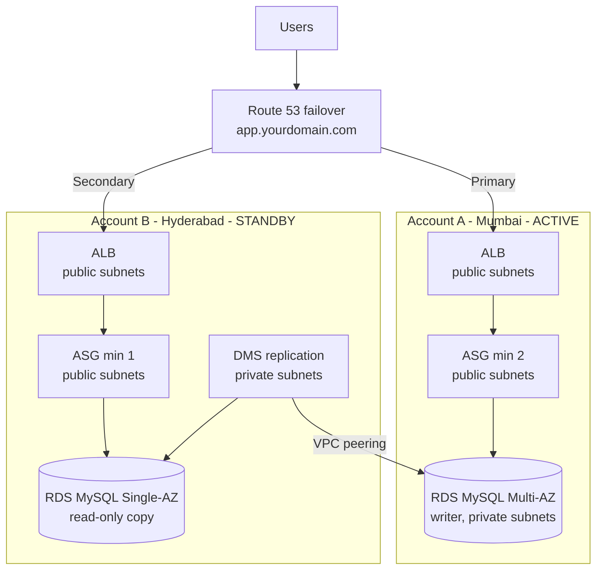

# Mumbai–Hyderabad Active/Standby DR Runbook

Sep 23, 2026 · @Someone

## 1. Architecture

Mumbai (Account A) serves all traffic. Hyderabad (Account B) keeps a live copy of the database and one warm web server, and Route 53 sends users there automatically when Mumbai's health check fails. Expected recovery: traffic moves in about 1–2 minutes, form submissions work again after about 5 more minutes of manual DB steps, and data loss is limited to a few seconds of replication lag.



DMS in Account B reads every change from the Mumbai database over VPC peering and writes it into the Hyderabad database.

### Components per account

| Component | Account A – Mumbai (ap-south-1) | Account B – Hyderabad (ap-south-2) |
| --- | --- | --- |
| VPC CIDR | 10.10.0.0/16 | 10.20.0.0/16 |
| Subnets | 2 public + 2 private | 2 public + 2 private |
| NAT gateway | None | None |
| ALB | mum-alb, public subnets | hyd-alb, public subnets |
| EC2 Auto Scaling | mum-asg, public subnets, min 2 / max 4 | hyd-asg, public subnets, min 1 / max 4 |
| RDS MySQL | mum-appdb, Multi-AZ, private subnets, writer | hyd-appdb, Single-AZ, private subnets, read-only for the app |
| DMS | Only during failback | hyd-dms (dms.t3.small, Single-AZ), task mum-to-hyd |
| VPC peering | Requester | Accepter |
| Route 53 | Hosted zone, 2 health checks, 2 failover records | None |
| ACM certificate | app.yourdomain.com (Mumbai) | app.yourdomain.com (Hyderabad) |
| KMS key | mum-ami-key (shared with Account B) | hyd-ami-key |
| Parameter Store | /app/db\_host, /app/db\_name, /app/db\_user, /app/db\_password | Same names, Hyderabad values |
| Admin box | mum-admin (t3.micro, kept stopped) | hyd-admin (t3.micro, kept stopped) |

### Security groups (created in both accounts)

| Security group | Inbound rules | Purpose |
| --- | --- | --- |
| alb-sg | TCP 80 and 443 from 0.0.0.0/0 | Users and Route 53 health checkers reach the ALB |
| app-sg | App port (80) from alb-sg only | EC2 has a public IP, but only the ALB can reach it |
| db-sg (A) | 3306 from app-sg; 3306 from 10.20.0.0/16 | App, plus Hyderabad DMS over peering |
| db-sg (B) | 3306 from app-sg; 3306 from dms-sg | App and DMS only |
| dms-sg (B) | None | DMS only makes outbound connections |

### Design decisions

- **No NAT gateways.** EC2 sits in public subnets and reaches the internet through the Internet Gateway, which removes the biggest fixed cost. app-sg still blocks all direct access.
- **Hyderabad ASG never goes to 0.** Route 53 only fails over to a secondary that is healthy, so one warm instance is required for automatic failover.
- **DMS instead of Aurora Global Database or RDS read replicas.** Those features only work inside one AWS account.
- **Schema is pre-created in Hyderabad.** DMS does not copy AUTO\_INCREMENT, secondary indexes, triggers or users, so without this the contact form would fail after failover.
- **Hyderabad is read-only through DB grants.** app\_user has only SELECT there until failover, so nothing can write into the database DMS is copying into.
- **DNS switch is automatic, DB promotion is manual.** This prevents two databases accepting writes at the same time (split-brain).

### Prerequisites

- The domain's hosted zone is in Route 53 in Account A. Replace `yourdomain.com` everywhere with the real domain.
- The app exposes `/health` that returns HTTP 200 only when the app can query the database.
- The app reads its DB settings from Parameter Store at startup (the four `/app/...` parameters).
- Both people have AdministratorAccess with MFA in their own account.
- The app's database name is written as `appdb` in this runbook. Replace it if yours differs.

## 2. Shared info sheet and work order

Person A works only in Account A and Person B works only in Account B; they meet at six handoffs (H1–H6). Keep passwords in a shared password manager, never in chat or email.

### Shared info sheet

| Item | Filled by | Needed by | Handoff | Value |
| --- | --- | --- | --- | --- |
| Account A ID (12 digits) | A | B | H1 |  |
| Account B ID (12 digits) | B | A | H1 |  |
| Agreed MySQL 8.0 version (listed in both regions) | A + B | A + B | H1 |  |
| Hyderabad VPC ID (hyd-dr) | B | A | H2 |  |
| Mumbai RDS endpoint | A | B | H3 |  |
| dms\_user password | A | B | H3 |  |
| app\_user password | A | B | H3 |  |
| Golden AMI ID (app-golden-v1) | A | B | H4 |  |
| mum-ami-key ARN | A | B | H4 |  |
| Hyderabad ACM validation CNAME name + value | B | A | H5 |  |
| Hyderabad ALB DNS name (hyd-alb) | B | A | H6 |  |
| Mumbai ALB DNS name (mum-alb) | A | reference | – |  |
| Hyderabad RDS endpoint | B | reference | – |  |

### Work order

| Stage | Person A – Account A (Mumbai) | Person B – Account B (Hyderabad) | Handoff |
| --- | --- | --- | --- |
| 1 | Prep, Account ID | Enable Hyderabad region, Account ID | H1: Account IDs + MySQL version, both ways |
| 2 | VPC, security groups, IAM role, KMS key | VPC, security groups, IAM role, KMS key | H2: B sends Hyderabad VPC ID |
| 3 | Create peering request, add routes | Accept peering, add routes | – |
| 4 | Mumbai RDS, DB users, Parameter Store | Hyderabad RDS, DMS replication instance | H3: A sends RDS endpoint + passwords |
| 5 | Golden AMI, share it | Pre-create schema, DMS endpoints and task | H4: A sends AMI ID + KMS ARN |
| 6 | ACM, ALB, launch template, ASG | Copy AMI, Parameter Store, ACM | H5: B sends ACM validation CNAME |
| 7 | Add B's ACM record | ALB, launch template, ASG | H6: B sends Hyderabad ALB DNS |
| 8 | Route 53 health checks + failover records, alarms | Alarms, replication check | – |
| 9 | Verification together | Verification together | – |

Most of stages 2–7 run in parallel. When a step says **WAIT**, stop there until the named handoff arrives.

## 3. Account A – Mumbai – Person A

Person A completes A1–A62 in Account A, with the region selector (top-right) on **Asia Pacific (Mumbai) ap-south-1** unless a step says otherwise.

### Stage 1 – Prep

**A1.** Log in to the Account A console with an AdministratorAccess user and MFA. *You create VPC, RDS, KMS, IAM, EC2 and Route 53 resources.*

**A2.** Region selector (top-right) → **Asia Pacific (Mumbai)**.

**A3.** Account name (top-right) → copy the 12-digit **Account ID** into the info sheet.

**A4.** Route 53 → **Hosted zones** → confirm `yourdomain.com` is listed. *The failover records live here. If it is missing, the domain must be moved to Route 53 in this account first.*

**A5.** RDS → **Create database** → Engine **MySQL** → open the **Engine version** list → note the newest 8.0.x → **Cancel**. *You and Person B pick one version available in both regions.*

**H1 – HANDOFF:** Send Person B your Account ID and the version list. Receive Account B ID and agree the MySQL version.

**A6.** IAM → **Roles** → search `AWSServiceRoleForAutoScaling`. If it is missing: **Create role** → AWS service → use case **EC2 Auto Scaling** → Next → **Create role**. *Auto Scaling needs this role to be allowed on the KMS key, otherwise instances from an encrypted AMI fail to launch.*

### Stage 2 – VPC, security groups, IAM, KMS

**A7.** VPC → **Create VPC** → fill every field:

- Resources to create: **VPC and more**
- Name tag auto-generation: ticked, `mum-prod`
- IPv4 CIDR block: `10.10.0.0/16`
- IPv6 CIDR block: **No IPv6 CIDR block**
- Tenancy: **Default**
- Number of Availability Zones: **2**
- Number of public subnets: **2**
- Number of private subnets: **2**
- NAT gateways: **None**
- VPC endpoints: **S3 Gateway**
- DNS options: tick **Enable DNS hostnames** and **Enable DNS resolution**

*Two AZs is the minimum for the ALB and RDS. No NAT because EC2 uses the Internet Gateway.*

**A8.** **Create VPC** → wait for all green ticks → **View VPC**.

**A9.** VPC → **Subnets** → filter VPC `mum-prod` → rename with the pencil icon:

- public subnet in AZ a → `mum-public-a`
- public subnet in AZ b → `mum-public-b`
- private subnet in AZ a → `mum-private-a`
- private subnet in AZ b → `mum-private-b`

*Clear names prevent choosing the wrong subnet later.*

**A10.** VPC → **Route tables** → filter `mum-prod` → note which tables have `private` in the name. *Only the private route tables get the peering route in A20.*

**A11.** VPC → **Security groups** → **Create security group** → name `alb-sg`, description `Public ALB`, VPC `mum-prod`:

- Inbound: **HTTP** 80, source **Anywhere-IPv4**
- Inbound: **HTTPS** 443, source **Anywhere-IPv4**
- Outbound: default → **Create security group**

**A12.** Create `app-sg`, description `Web servers`, VPC `mum-prod`:

- Inbound: **Custom TCP** 80, source **Custom** → `alb-sg` → **Create**

*EC2 has a public IP, but only the ALB can reach it.*

**A13.** Create `db-sg`, description `Mumbai RDS`, VPC `mum-prod`:

- Inbound: **MYSQL/Aurora** 3306, source `app-sg`
- Inbound: **MYSQL/Aurora** 3306, source **Custom** `10.20.0.0/16`, description `Hyderabad DMS via peering` → **Create**

**A14.** IAM → **Roles** → **Create role** → AWS service → **EC2** → Next → attach `AmazonSSMManagedInstanceCore` and `AmazonSSMReadOnlyAccess` → Next → name `app-ec2-role` → **Create role**. *Browser login through Session Manager and read access to Parameter Store.*

**A15.** KMS → **Create key** → Key type **Symmetric**, usage **Encrypt and decrypt**, Advanced: **KMS**, **Single-Region key** → Next.

**A16.** Alias `mum-ami-key` → Next → Key administrators: your admin user/role → Next.

**A17.** Key users: tick your admin user/role and `AWSServiceRoleForAutoScaling`. Under **Other AWS accounts** → **Add another AWS account** → Account B ID → Next → **Finish**. *Account B can copy the AMI, and your ASG can launch from it. The default aws/ebs key cannot be shared.*

**A18.** Open `mum-ami-key` → copy the **ARN** into the info sheet.

### Stage 3 – VPC peering

**WAIT** for H2 (Hyderabad VPC ID).

**A19.** VPC → **Peering connections** → **Create peering connection**:

- Name `mum-hyd-peer`
- VPC ID (Requester): `mum-prod`
- Account: **Another account** → Account B ID
- Region: **Another Region** → **Asia Pacific (Hyderabad) ap-south-2**
- VPC ID (Accepter): Hyderabad VPC ID → **Create peering connection**

Tell Person B the request is sent, then **WAIT** until B says it is accepted (status **Active**).

**A20.** VPC → **Route tables** → for each **private** route table: **Routes** tab → **Edit routes** → **Add route** → Destination `10.20.0.0/16`, Target **Peering Connection** → `mum-hyd-peer` → **Save changes**. *Replies from Mumbai RDS to Hyderabad go back over peering.*

### Stage 4 – Mumbai RDS

**A21.** RDS → **Subnet groups** → **Create DB subnet group** → name `mum-db-subnets`, description `Mumbai DB`, VPC `mum-prod`, both AZs, subnets `mum-private-a` and `mum-private-b` → **Create**.

**A22.** RDS → **Parameter groups** → **Create parameter group** → Engine type **MySQL Community**, family **mysql8.0**, type **DB Parameter Group**, name `mum-mysql-dms`, description `binlog for DMS` → **Create**.

**A23.** Open `mum-mysql-dms` → **Edit** → search `binlog_format` → set **ROW** → **Save changes**. *DMS needs row-level binary logs to copy each change.*

**A24.** RDS → **Databases** → **Create database** → fill every field:

- Creation method: **Standard create**
- Engine: **MySQL**, version = agreed version (H1)
- Templates: **Production**
- Deployment options: **Multi-AZ DB instance**
- DB instance identifier: `mum-appdb`
- Master username: `admin`
- Credentials management: **Self managed**, strong password, saved in the password manager
- DB instance class: **Burstable** → `db.t4g.small` (or `db.t3.small` if not listed)
- Storage type: **gp3**, allocated storage **20 GiB**
- Storage autoscaling: ticked, maximum **100 GiB**
- Compute resource: **Don't connect to an EC2 compute resource**
- Network type: **IPv4**
- VPC: `mum-prod`, DB subnet group: `mum-db-subnets`
- Public access: **No**
- VPC security group: **Choose existing** → remove `default`, add `db-sg`
- Availability Zone: **No preference**
- Database authentication: **Password authentication**
- Monitoring: keep defaults
- Additional configuration → Initial database name: `appdb`
- DB parameter group: `mum-mysql-dms`
- Backup retention period: **7 days**
- Encryption: **Enable encryption** (default key)
- Deletion protection: ticked

*Multi-AZ covers an AZ failure inside Mumbai in 1–2 minutes without a region switch. Backups must be on for binary logs.*

**A25.** **Create database** → wait 15–20 minutes for **Available** → open `mum-appdb` → **Connectivity & security** → copy the **Endpoint** into the info sheet.

### Stage 5 – Admin box and DB users

**A26.** EC2 → **Launch instance** → fill:

- Name `mum-admin`
- AMI **Amazon Linux 2023**
- Instance type `t3.micro`
- Key pair: **Proceed without a key pair**
- Network settings → **Edit** → VPC `mum-prod`, subnet `mum-public-a`, Auto-assign public IP **Enable**
- Security group: **Select existing** → `app-sg`
- Advanced details → IAM instance profile `app-ec2-role` → **Launch instance**

*app-sg is already allowed into db-sg, and Session Manager needs no inbound ports.*

**A27.** Wait 3 minutes → select `mum-admin` → **Connect** → **Session Manager** tab → **Connect**. *A terminal opens in the browser. No SSH keys and no AWS CLI.*

**A28.** In that terminal, install the MySQL client:

```
sudo dnf install -y mariadb105
```

**A29.** Connect to Mumbai RDS (enter the admin password when asked):

```
mysql -h <MUMBAI-ENDPOINT> -u admin -p
```

**A30.** Run this SQL, replacing the two passwords:

```
call mysql.rds_set_configuration('binlog retention hours', 24);
CREATE USER 'dms_user'@'%' IDENTIFIED BY '<DMS-PASSWORD>';
GRANT SELECT, SHOW VIEW, TRIGGER, REPLICATION CLIENT, REPLICATION SLAVE ON *.* TO 'dms_user'@'%';
CREATE USER 'app_user'@'%' IDENTIFIED BY '<APP-PASSWORD>';
GRANT SELECT, INSERT, UPDATE, DELETE ON appdb.* TO 'app_user'@'%';
exit
```

*Binary logs are kept 24 hours so DMS never misses a change. DMS and the app each get their own limited user.*

**A31.** Create the app's tables in `appdb` now (your app's migration or its CREATE TABLE SQL), if the app does not create them itself. *Person B copies this schema to Hyderabad in B34–B36.*

**A32.** EC2 → select `mum-admin` → **Instance state** → **Stop instance**. *It is only needed for DB work, so stopping it saves cost.*

**H3 – HANDOFF:** Send Person B the Mumbai RDS endpoint, the dms\_user password and the app\_user password.

**A33.** Systems Manager → **Parameter Store** → **Create parameter** four times (Tier **Standard**):

- `/app/db_host` → Type **String** → Mumbai RDS endpoint
- `/app/db_name` → Type **String** → `appdb`
- `/app/db_user` → Type **String** → `app_user`
- `/app/db_password` → Type **SecureString**, KMS key source **My current account**, key `alias/aws/ssm` → app\_user password

*The same AMI connects to the local database in each region.*

### Stage 6 – Golden AMI

**A34.** EC2 → **Launch instance** → fill:

- Name `app-builder`
- AMI: the OS your app uses (e.g. **Amazon Linux 2023**)
- Instance type `t3.small`
- Key pair: **Proceed without a key pair**
- Network settings → **Edit** → VPC `mum-prod`, subnet `mum-public-a`, Auto-assign public IP **Enable**, security group `app-sg`
- Configure storage → **Advanced** → volume → Encrypted **Encrypted**, KMS key `mum-ami-key`
- Advanced details → IAM instance profile `app-ec2-role` → **Launch instance**

**A35.** **Connect** → **Session Manager** → install the website and set it up so that:

- it reads the four `/app/...` parameters at startup
- `/health` returns HTTP 200 only when a `SELECT 1` on the database works
- it starts automatically on boot (systemd service)

*The ALB and Route 53 decide healthy or unhealthy from /health.*

**A36.** In the same terminal, check the health URL:

```
curl -i http://localhost/health
```

Expect `HTTP/1.1 200`.

**A37.** EC2 → select `app-builder` → **Actions** → **Image and templates** → **Create image** → name `app-golden-v1`, reboot left on → **Create image**.

**A38.** EC2 → **AMIs** → wait for **Available** → copy the AMI ID into the info sheet.

**A39.** Select the AMI → **Actions** → **Edit AMI permissions** → **Private** → **Add account ID** → Account B ID → tick **Add "create volume" permissions to the associated snapshots** → **Save changes**. *Account B can now see and copy the AMI.*

**A40.** EC2 → Instances → select `app-builder` → **Instance state** → **Terminate instance**. *The AMI holds everything, so the builder is no longer needed.*

**H4 – HANDOFF:** Send Person B the AMI ID and the mum-ami-key ARN.

### Stage 7 – Certificate, target group, ALB

**A41.** Certificate Manager → **Request** → **Request a public certificate** → Next → Fully qualified domain name `app.yourdomain.com`, validation **DNS validation**, key algorithm **RSA 2048** → **Request**.

**A42.** Open the certificate → **Create records in Route 53** → **Create records** → wait for status **Issued**. *The hosted zone is in this account, so validation is automatic.*

**A43.** EC2 → **Target Groups** → **Create target group** → fill:

- Target type **Instances**, name `mum-tg`
- Protocol **HTTP**, port **80**, IP address type **IPv4**, VPC `mum-prod`, protocol version **HTTP1**
- Health check protocol **HTTP**, path `/health`
- Advanced: port **Traffic port**, healthy threshold **3**, unhealthy threshold **2**, timeout **5**, interval **15**, success codes **200**
- **Next** → register nothing → **Create target group**

*The ASG registers instances automatically.*

**A44.** EC2 → **Load Balancers** → **Create load balancer** → **Application Load Balancer** → **Create** → fill:

- Name `mum-alb`, scheme **Internet-facing**, IP address type **IPv4**
- VPC `mum-prod`; mappings: tick both AZs → `mum-public-a`, `mum-public-b`
- Security groups: remove `default`, add `alb-sg`
- Listener **HTTP : 80** → forward to `mum-tg`
- **Add listener** → **HTTPS : 443** → forward to `mum-tg`
- Secure listener settings: security policy = recommended default, certificate **From ACM** → `app.yourdomain.com`
- **Create load balancer**

**A45.** Wait for state **Active** → copy the **DNS name** into the info sheet.

**A46.** Open `mum-alb` → **Listeners** → select **HTTP:80** → **Actions** → **Edit listener** → default action **Redirect to URL** → **URI parts** → protocol **HTTPS**, port **443**, status **301 - Permanently moved** → **Save changes**. *All visitors end up on HTTPS.*

### Stage 8 – Launch template and Auto Scaling

**A47.** EC2 → **Launch Templates** → **Create launch template** → fill:

- Name `mum-app-lt`, version description `v1`
- Tick **Provide guidance to help me set up a template that I can use with EC2 Auto Scaling**
- AMI: **My AMIs** → **Owned by me** → `app-golden-v1`
- Instance type `t3.small`
- Key pair: **Don't include in launch template**
- Network settings → Subnet: **Don't include in launch template**
- **Advanced network configuration** → **Add network interface** → Auto-assign public IP **Enable**, security groups `app-sg`
- Storage: keep as in the AMI (encrypted)
- Advanced details → IAM instance profile `app-ec2-role`
- Advanced details → Metadata version **V2 only (token required)**
- **Create launch template**

*Instances in public subnets need a public IP to reach the internet without NAT.*

**A48.** EC2 → **Auto Scaling Groups** → **Create Auto Scaling group**:

- Screen 1: name `mum-asg`, launch template `mum-app-lt`, version **Latest** → Next
- Screen 2: VPC `mum-prod`, subnets `mum-public-a`, `mum-public-b`, AZ distribution **Balanced best effort** → Next
- Screen 3: **Attach to an existing load balancer** → **Choose from your load balancer target groups** → `mum-tg`; VPC Lattice **No**; tick **Turn on Elastic Load Balancing health checks**; grace period **300** → Next
- Screen 4: Desired **2**, Min **2**, Max **4**; **Target tracking scaling policy** → **Average CPU utilization**, target **50**, instance warmup **300**; instance maintenance policy **Launch before terminating** → Next
- Screen 5: notifications → Next
- Screen 6: tag Key `Name`, Value `mum-app` → Next
- Screen 7: review → **Create Auto Scaling group**

*Two servers mean no downtime when one fails. ELB health checks replace a server whose app stops answering.*

**A49.** EC2 → **Target Groups** → `mum-tg` → **Targets** → wait until 2 targets are **healthy**.

**A50.** Browser → `https://<mum-alb DNS>/health` → expect 200. *A certificate warning is normal here because the URL is the ALB name, not your domain.*

### Stage 9 – Route 53 failover

**WAIT** for H5 (Hyderabad ACM validation CNAME).

**A51.** Route 53 → **Hosted zones** → `yourdomain.com` → **Create record** → Record name = the CNAME name from Person B without `.yourdomain.com.` at the end, type **CNAME**, value = the CNAME value, TTL **300** → **Create records**. *Hyderabad's certificate can only be validated in this hosted zone.*

**WAIT** for H6 (Hyderabad ALB DNS).

**A52.** Route 53 → **Health checks** → **Create health check** → fill:

- Name `hc-mumbai`, what to monitor **Endpoint**
- Specify endpoint by **Domain name**, protocol **HTTPS**, domain name = mum-alb DNS, port **443**, path `/health`
- Advanced: request interval **Fast (10 seconds)**, failure threshold **3**, string matching **No**, invert **No**, health checker regions **Use recommended**
- Next → Get notified **Yes** → **New SNS topic** `dr-alerts` → both people's emails → **Create health check**

*Mumbai is marked down after about 30 seconds of failures. The alarm and topic are created in N. Virginia, which is how Route 53 alarms work.*

**A53.** Create a second health check `hc-hyderabad` with the same settings and domain name = Hyderabad ALB DNS → Get notified **Yes** → **Existing SNS topic** `dr-alerts`. *Route 53 only fails over to Hyderabad if Hyderabad is itself healthy.*

**A54.** Wait until both health checks show **Healthy** (about 2 minutes).

**A55.** Hosted zone → **Create record** → fill:

- Record name `app`, type **CNAME**, value = mum-alb DNS, TTL **60**
- Routing policy **Failover**, failover record type **Primary**
- Health check ID `hc-mumbai`, record ID `mumbai-primary`

**A56.** On the same page → **Add another record** → fill:

- Record name `app`, type **CNAME**, value = Hyderabad ALB DNS, TTL **60**
- Routing policy **Failover**, failover record type **Secondary**
- Health check ID `hc-hyderabad`, record ID `hyd-secondary` → **Create records**

*A 60-second TTL means users pick up a switch within about a minute.*

**A57.** Browser → `https://app.yourdomain.com` → page loads with a valid padlock → submit one test contact form. *Person B checks this entry reaches Hyderabad in B67.*

### Stage 10 – Monitoring

**A58.** SNS (region Mumbai) → **Topics** → **Create topic** → **Standard**, name `mum-alerts` → **Create topic** → **Create subscription** → protocol **Email** → your email; repeat for Person B's email.

**A59.** Both people open the AWS emails for `dr-alerts` and `mum-alerts` → **Confirm subscription**. *Unconfirmed subscriptions send nothing.*

**A60.** CloudWatch → **Alarms** → **Create alarm** → **Select metric** → **ApplicationELB** → **Per AppELB, per TG Metrics** → `UnHealthyHostCount` for `mum-tg` → statistic **Maximum**, period **1 minute** → **Greater than 0** → Additional configuration: **3 out of 3** datapoints → notify `mum-alerts` → name `mum-unhealthy-hosts` → **Create alarm**.

**A61.** Create alarm → **ApplicationELB** → **Per AppELB Metrics** → `HTTPCode_Target_5XX_Count` for `mum-alb` → statistic **Sum**, period **5 minutes** → **Greater than 10** → `mum-alerts` → name `mum-5xx` → **Create alarm**.

**A62.** Create alarm → **RDS** → **Per-Database Metrics** → `FreeStorageSpace` for `mum-appdb` → **Lower than 2000000000** (2 GB) → `mum-alerts` → name `mum-db-storage` → **Create alarm**. *Warnings arrive before users notice a problem.*

## 4. Account B – Hyderabad – Person B

Person B completes B1–B67 in Account B, with the region selector on **Asia Pacific (Hyderabad) ap-south-2**. Steps B48–B49 are the only ones done in the Mumbai region, on purpose.

### Stage 1 – Prep

**B1.** Log in to the Account B console with an AdministratorAccess user and MFA.

**B2.** Account name (top-right) → **Account** → **AWS Regions** → select **Asia Pacific (Hyderabad)** → **Enable** → confirm → refresh until the status is **Enabled**. *Hyderabad is an opt-in region and does not appear in the region list until enabled.*

**B3.** Region selector → **Asia Pacific (Hyderabad)**.

**B4.** Account name → copy the 12-digit **Account ID** into the info sheet.

**B5.** RDS → **Create database** → Engine **MySQL** → open **Engine version** → note the 8.0.x versions listed → **Cancel**. *Both databases must run the same version for replication.*

**H1 – HANDOFF:** Send Person A your Account ID and the version list. Receive Account A ID and agree the MySQL version.

**B6.** IAM → **Roles** → search `AWSServiceRoleForAutoScaling`. If it is missing: **Create role** → AWS service → use case **EC2 Auto Scaling** → Next → **Create role**. *Auto Scaling needs this role to be allowed on your KMS key.*

### Stage 2 – VPC, security groups, IAM, KMS

**B7.** VPC → **Create VPC** → fill every field:

- Resources to create: **VPC and more**
- Name tag auto-generation: ticked, `hyd-dr`
- IPv4 CIDR block: `10.20.0.0/16`
- IPv6 CIDR block: **No IPv6 CIDR block**
- Tenancy: **Default**
- Number of Availability Zones: **2**
- Number of public subnets: **2**
- Number of private subnets: **2**
- NAT gateways: **None**
- VPC endpoints: **S3 Gateway**
- DNS options: tick **Enable DNS hostnames** and **Enable DNS resolution**

*Same shape as Mumbai, so failover behaves the same. The CIDR must not overlap 10.10.0.0/16.*

**B8.** **Create VPC** → wait for all green ticks → **View VPC** → copy the **VPC ID** into the info sheet.

**B9.** VPC → **Subnets** → filter VPC `hyd-dr` → rename with the pencil icon:

- public subnet in AZ a → `hyd-public-a`
- public subnet in AZ b → `hyd-public-b`
- private subnet in AZ a → `hyd-private-a`
- private subnet in AZ b → `hyd-private-b`

**B10.** VPC → **Route tables** → filter `hyd-dr` → note the public route table and the private route table(s). *All of them get the peering route in B21.*

**H2 – HANDOFF:** Send Person A the hyd-dr VPC ID.

**B11.** VPC → **Security groups** → **Create security group** → name `alb-sg`, description `Public ALB`, VPC `hyd-dr`:

- Inbound: **HTTP** 80, source **Anywhere-IPv4**
- Inbound: **HTTPS** 443, source **Anywhere-IPv4** → **Create security group**

**B12.** Create `app-sg`, description `Web servers`, VPC `hyd-dr`:

- Inbound: **Custom TCP** 80, source **Custom** → `alb-sg` → **Create**

**B13.** Create `dms-sg`, description `DMS replication`, VPC `hyd-dr`, no inbound rules → **Create**. *DMS only makes outbound connections.*

**B14.** Create `db-sg`, description `Hyderabad RDS`, VPC `hyd-dr`:

- Inbound: **MYSQL/Aurora** 3306, source `app-sg`
- Inbound: **MYSQL/Aurora** 3306, source `dms-sg` → **Create**

**B15.** IAM → **Roles** → **Create role** → AWS service → **EC2** → Next → attach `AmazonSSMManagedInstanceCore` and `AmazonSSMReadOnlyAccess` → Next → name `app-ec2-role` → **Create role**.

**B16.** KMS → **Create key** → **Symmetric**, **Encrypt and decrypt**, Advanced: **KMS**, **Single-Region key** → Next.

**B17.** Alias `hyd-ami-key` → Next → Key administrators: your admin user/role → Next.

**B18.** Key users: tick your admin user/role and `AWSServiceRoleForAutoScaling` → Next → **Finish**. *The copied AMI is encrypted with a key Account B owns, so it keeps working even if Account A has problems.*

### Stage 3 – Accept peering

**WAIT** until Person A says the peering request is sent.

**B19.** VPC → **Peering connections** → select the row with status **Pending acceptance** → check Requester CIDR `10.10.0.0/16` and Requester owner = Account A ID → **Actions** → **Accept request** → **Accept request**. *Checking first makes sure you accept the right request.*

**B20.** Name it `mum-hyd-peer` with the pencil icon → tell Person A the status is **Active**.

**B21.** VPC → **Route tables** → for **each** route table in `hyd-dr` (public and private): **Routes** tab → **Edit routes** → **Add route** → Destination `10.10.0.0/16`, Target **Peering Connection** → `mum-hyd-peer` → **Save changes**. *DMS in the private subnets and the admin box in the public subnet both need to reach Mumbai.*

### Stage 4 – Hyderabad RDS and DMS instance

**B22.** RDS → **Subnet groups** → **Create DB subnet group** → name `hyd-db-subnets`, description `Hyderabad DB`, VPC `hyd-dr`, both AZs, subnets `hyd-private-a` and `hyd-private-b` → **Create**.

**B23.** RDS → **Parameter groups** → **Create parameter group** → **MySQL Community**, family **mysql8.0**, type **DB Parameter Group**, name `hyd-mysql-dms`, description `binlog for failback` → **Create**.

**B24.** Open `hyd-mysql-dms` → **Edit** → `binlog_format` = **ROW** → **Save changes**. *Not used today, but needed when Hyderabad becomes the source during failback.*

**B25.** RDS → **Databases** → **Create database** → fill every field:

- Creation method: **Standard create**
- Engine: **MySQL**, version = agreed version (H1)
- Templates: **Production**
- Deployment options: **Single-AZ DB instance**
- DB instance identifier: `hyd-appdb`
- Master username: `admin`
- Credentials management: **Self managed**, strong password, saved in the password manager
- DB instance class: same as Mumbai (`db.t4g.small` or `db.t3.small`)
- Storage type: **gp3**, **20 GiB**, storage autoscaling ticked, maximum **100 GiB**
- Compute resource: **Don't connect to an EC2 compute resource**
- Network type: **IPv4**
- VPC: `hyd-dr`, DB subnet group: `hyd-db-subnets`
- Public access: **No**
- VPC security group: **Choose existing** → remove `default`, add `db-sg`
- Availability Zone: **No preference**
- Database authentication: **Password authentication**
- Additional configuration → Initial database name: leave **blank**
- DB parameter group: `hyd-mysql-dms`
- Backup retention period: **7 days**
- Encryption: **Enable encryption**
- Deletion protection: ticked

*Single-AZ is enough for a standby. It can be changed to Multi-AZ from the console if Hyderabad serves traffic for a long time. The database itself is created by the schema import in B36.*

**B26.** **Create database** → wait for **Available** → **Connectivity & security** → copy the **Endpoint** into the info sheet.

**B27.** DMS → **Subnet groups** → **Create subnet group** → name `hyd-dms-subnets`, description `DMS private`, VPC `hyd-dr`, add `hyd-private-a` and `hyd-private-b` → **Create subnet group**.

**B28.** DMS → **Replication instances** → **Create replication instance** → fill:

- Name `hyd-dms`, description `Mumbai to Hyderabad`
- Instance class `dms.t3.small`
- Engine version: default
- High availability: **Dev or test workload (Single-AZ)**
- Allocated storage: **50 GiB**
- Network type: **IPv4**, VPC `hyd-dr`, replication subnet group `hyd-dms-subnets`
- **Publicly accessible: unticked**
- Advanced settings → VPC security group: `dms-sg` (remove default)
- **Create replication instance**

*A contact form writes very little, so a small single-AZ instance is enough. Alarms in B64–B65 report if it stops.*

**B29.** Wait about 10 minutes for status **Available**.

### Stage 5 – Admin box, schema and DB users

**WAIT** for H3 (Mumbai endpoint, dms\_user and app\_user passwords). Person A must have finished A31.

**B30.** EC2 → **Launch instance** → fill:

- Name `hyd-admin`
- AMI **Amazon Linux 2023**, instance type `t3.micro`
- Key pair: **Proceed without a key pair**
- Network settings → **Edit** → VPC `hyd-dr`, subnet `hyd-public-a`, Auto-assign public IP **Enable**
- Security group: **Select existing** → `app-sg`
- Advanced details → IAM instance profile `app-ec2-role` → **Launch instance**

**B31.** Wait 3 minutes → select `hyd-admin` → **Connect** → **Session Manager** → **Connect**.

**B32.** Install the MySQL client:

```
sudo dnf install -y mariadb105
```

**B33.** Test the link to Mumbai (enter the dms\_user password):

```
mysql -h <MUMBAI-ENDPOINT> -u dms_user -p -e "SELECT 1;"
```

Expect a table showing `1`. If it hangs, check A13, A20, B21 and that peering is **Active**. *This proves peering, routes and security groups work before DMS is set up.*

**B34.** Copy the Mumbai table structure (no data) into a file:

```
mysqldump -h <MUMBAI-ENDPOINT> -u dms_user -p --no-data --single-transaction --triggers --databases appdb > schema.sql
```

*DMS does not copy AUTO\_INCREMENT, indexes or triggers, so the structure is created here first.*

**B35.** Check the file has your tables:

```
grep -c "CREATE TABLE" schema.sql
```

The number must match the table count Person A expects.

**B36.** Load the structure into Hyderabad (enter the Hyderabad admin password):

```
mysql -h <HYDERABAD-ENDPOINT> -u admin -p < schema.sql
```

**B37.** Connect to Hyderabad:

```
mysql -h <HYDERABAD-ENDPOINT> -u admin -p
```

**B38.** Run this SQL, using the same passwords Person A set:

```
call mysql.rds_set_configuration('binlog retention hours', 24);
CREATE USER 'app_user'@'%' IDENTIFIED BY '<APP-PASSWORD>';
GRANT SELECT ON appdb.* TO 'app_user'@'%';
CREATE USER 'dms_user'@'%' IDENTIFIED BY '<DMS-PASSWORD>';
GRANT SELECT, SHOW VIEW, TRIGGER, REPLICATION CLIENT, REPLICATION SLAVE ON *.* TO 'dms_user'@'%';
SHOW TABLES FROM appdb;
exit
```

*app\_user can only read here, so nothing writes into the database DMS is filling. dms\_user is ready for failback.*

**B39.** EC2 → select `hyd-admin` → **Instance state** → **Stop instance**.

### Stage 6 – DMS endpoints and task

**B40.** DMS → **Endpoints** → **Create endpoint** → fill:

- Endpoint type: **Source endpoint**
- Select RDS DB instance: **unticked** (the Mumbai DB is in another account)
- Endpoint identifier `mumbai-source`
- Source engine **MySQL**
- Access to endpoint database: **Provide access information manually**
- Server name: Mumbai RDS endpoint, port **3306**
- Secure Socket Layer (SSL) mode: **none**
- User name `dms_user`, password from H3

*Traffic stays inside the peering connection. SSL mode can be raised to require later.*

**B41.** Expand **Test endpoint connection (optional)** → VPC `hyd-dr` → replication instance `hyd-dms` → **Run test** → wait for **successful** → **Create endpoint**.

**B42.** **Create endpoint** → fill:

- Endpoint type: **Target endpoint**
- Tick **Select RDS DB instance** → `hyd-appdb`
- Endpoint identifier `hyd-target`
- User name `admin`, password = Hyderabad admin password
- **Run test** → **successful** → **Create endpoint**

**B43.** DMS → **Database migration tasks** → **Create task** → Task configuration:

- Task identifier `mum-to-hyd`
- Replication instance `hyd-dms`
- Source database endpoint `mumbai-source`
- Target database endpoint `hyd-target`
- Migration type: **Migrate existing data and replicate ongoing changes**

*A full copy first, then every new change within seconds.*

**B44.** Task settings:

- Editing mode: **Wizard**
- Target table preparation mode: **Truncate**
- Stop task after full load completes: **Don't stop**
- LOB column settings: **Limited LOB mode**, maximum LOB size **32 KB**
- Tick **Turn on CloudWatch logs**

*Truncate keeps the structure loaded in B36.*

**B45.** Table mappings → **Selection rules** → **Add new selection rule**:

- Schema: **Enter a schema** → `appdb`
- Source table name: `%`
- Action: **Include**

**B46.** Premigration assessment: off. Migration task startup configuration: **Automatically on create** → **Create task**.

**B47.** Watch the task status change to **Load complete, replication ongoing** → open the task → **Table statistics** → every table shows **Table completed**.

### Stage 7 – Copy the AMI

**WAIT** for H4 (AMI ID and KMS ARN).

**B48.** Region selector → **Asia Pacific (Mumbai)** → EC2 → **AMIs** → dropdown **Private images** → search the AMI ID. *A shared AMI only appears in the region where it was shared.*

**B49.** Select it → **Actions** → **Copy AMI** → fill:

- Name `app-golden-v1-hyd`
- Destination Region **Asia Pacific (Hyderabad)**
- Tick **Encrypt EBS snapshots of AMI copy** → KMS key `hyd-ami-key`
- **Copy AMI**

**B50.** Region selector → **Asia Pacific (Hyderabad)** → EC2 → **AMIs** → **Owned by me** → wait for **Available** (10–30 minutes).

### Stage 8 – Parameter Store

**B51.** Systems Manager → **Parameter Store** → **Create parameter** four times (Tier **Standard**):

- `/app/db_host` → **String** → Hyderabad RDS endpoint
- `/app/db_name` → **String** → `appdb`
- `/app/db_user` → **String** → `app_user`
- `/app/db_password` → **SecureString**, KMS key `alias/aws/ssm` → app\_user password

*Same names as Mumbai, so the same AMI finds the local database.*

### Stage 9 – Certificate

**B52.** Certificate Manager → **Request** → **Request a public certificate** → Next → `app.yourdomain.com`, **DNS validation**, **RSA 2048** → **Request**.

**B53.** Open the certificate → **Domains** → copy **CNAME name** and **CNAME value**.

**H5 – HANDOFF:** Send both values to Person A. *The hosted zone is in Account A, so only Person A can add the validation record.*

**B54.** Refresh until the status is **Issued** (5–30 minutes after Person A adds the record).

### Stage 10 – Target group and ALB

**B55.** EC2 → **Target Groups** → **Create target group** → fill:

- Target type **Instances**, name `hyd-tg`
- Protocol **HTTP**, port **80**, **IPv4**, VPC `hyd-dr`, **HTTP1**
- Health check protocol **HTTP**, path `/health`
- Advanced: **Traffic port**, healthy **3**, unhealthy **2**, timeout **5**, interval **15**, success codes **200**
- **Next** → register nothing → **Create target group**

**B56.** EC2 → **Load Balancers** → **Create load balancer** → **Application Load Balancer** → **Create** → fill:

- Name `hyd-alb`, **Internet-facing**, **IPv4**
- VPC `hyd-dr`; mappings: both AZs → `hyd-public-a`, `hyd-public-b`
- Security groups: remove `default`, add `alb-sg`
- Listener **HTTP : 80** → forward to `hyd-tg`
- **Add listener** → **HTTPS : 443** → forward to `hyd-tg`, recommended security policy, certificate **From ACM** → `app.yourdomain.com`
- **Create load balancer**

**B57.** Wait for **Active** → copy the **DNS name** into the info sheet.

**B58.** Open `hyd-alb` → **Listeners** → **HTTP:80** → **Actions** → **Edit listener** → **Redirect to URL** → **URI parts** → **HTTPS**, port **443**, **301** → **Save changes**.

### Stage 11 – Launch template and Auto Scaling

**B59.** EC2 → **Launch Templates** → **Create launch template** → fill:

- Name `hyd-app-lt`, version description `v1`
- Tick **Provide guidance to help me set up a template that I can use with EC2 Auto Scaling**
- AMI: **My AMIs** → **Owned by me** → `app-golden-v1-hyd`
- Instance type `t3.small`
- Key pair: **Don't include in launch template**
- Network settings → Subnet: **Don't include in launch template**
- **Advanced network configuration** → **Add network interface** → Auto-assign public IP **Enable**, security groups `app-sg`
- Storage: keep as in the AMI (encrypted)
- Advanced details → IAM instance profile `app-ec2-role`
- Advanced details → Metadata version **V2 only (token required)**
- **Create launch template**

**B60.** EC2 → **Auto Scaling Groups** → **Create Auto Scaling group**:

- Screen 1: name `hyd-asg`, launch template `hyd-app-lt`, version **Latest** → Next
- Screen 2: VPC `hyd-dr`, subnets `hyd-public-a`, `hyd-public-b`, **Balanced best effort** → Next
- Screen 3: **Attach to an existing load balancer** → target group `hyd-tg`; VPC Lattice **No**; tick **Turn on Elastic Load Balancing health checks**; grace period **300** → Next
- Screen 4: Desired **1**, Min **1**, Max **4**; **Target tracking scaling policy** → **Average CPU utilization** **50**, warmup **300**; maintenance policy **Launch before terminating** → Next
- Screen 5: Next
- Screen 6: tag `Name` = `hyd-app` → Next
- Screen 7: **Create Auto Scaling group**

*One warm server keeps the Route 53 health check green, which automatic failover requires.*

**B61.** EC2 → **Target Groups** → `hyd-tg` → **Targets** → wait for 1 target **healthy**.

**B62.** Browser → `https://<hyd-alb DNS>/health` → expect 200 (a certificate warning is normal here).

**H6 – HANDOFF:** Send Person A the hyd-alb DNS name.

### Stage 12 – Monitoring and replication check

**B63.** SNS (region Hyderabad) → **Topics** → **Create topic** → **Standard**, name `hyd-alerts` → **Create topic** → **Create subscription** → **Email** → your email; repeat for Person A's email. Both people click **Confirm subscription** in the email.

**B64.** CloudWatch → **Alarms** → **Create alarm** → **Select metric** → **DMS** → **ReplicationInstanceIdentifier, ReplicationTaskIdentifier** → tick `CDCLatencyTarget` for task `mum-to-hyd` → **Select metric** → statistic **Average**, period **1 minute** → **Greater than 60** → **5 out of 5** datapoints → notify `hyd-alerts` → name `hyd-dms-lag` → **Create alarm**. *Replication lag equals the data you would lose at failover.*

**B65.** DMS → **Event subscriptions** → **Create event subscription** → name `hyd-dms-events`, target **Existing topic** `hyd-alerts`, source type **Replication task**, event categories **failure** and **state change**, source **Specific** → `mum-to-hyd` → **Create**. *An email arrives the moment replication stops.*

**B66.** CloudWatch → **Create alarm** → **ApplicationELB** → **Per AppELB, per TG Metrics** → `UnHealthyHostCount` for `hyd-tg` → **Maximum**, **1 minute** → **Greater than 0** → **3 out of 3** → `hyd-alerts` → name `hyd-unhealthy-hosts` → **Create alarm**. *You learn DR is broken now, not during an outage.*

**B67.** After Person A finishes A57: start `hyd-admin` → **Session Manager** → run (replace the table name):

```
mysql -h <HYDERABAD-ENDPOINT> -u admin -p -e "SELECT * FROM appdb.<CONTACT-TABLE> ORDER BY 1 DESC LIMIT 5;"
```

Person A's test entry must be in the list. Then **Stop instance** on `hyd-admin`. *This proves a real form submission travels Mumbai → Hyderabad.*

## 5. Final verification

The setup is ready only when every row below matches; do this together on a call.

| # | Check | Who | Where | Expected |
| --- | --- | --- | --- | --- |
| V1 | Peering | A + B | VPC → Peering connections | Active on both sides |
| V2 | Peering routes | A + B | Route tables | A: private tables have 10.20.0.0/16; B: all tables have 10.10.0.0/16 |
| V3 | Mumbai RDS | A | RDS → Databases | mum-appdb Available, Multi-AZ Yes |
| V4 | Hyderabad RDS | B | RDS → Databases | hyd-appdb Available |
| V5 | Replication | B | DMS → Tasks → mum-to-hyd | Load complete, replication ongoing |
| V6 | Replication lag | B | DMS task → CloudWatch metrics | CDCLatencyTarget under 10 seconds |
| V7 | Real data flow | A + B | A57 then B67 | Test form entry visible in Hyderabad |
| V8 | Mumbai web | A | Target group mum-tg | 2 healthy |
| V9 | Hyderabad web | B | Target group hyd-tg | 1 healthy |
| V10 | Certificates | A + B | ACM in each region | Issued |
| V11 | Health checks | A | Route 53 → Health checks | hc-mumbai and hc-hyderabad Healthy |
| V12 | Failover records | A | Hosted zone | app: Primary → mum-alb, Secondary → hyd-alb, TTL 60 |
| V13 | Website | A + B | Browser → https://app.yourdomain.com | Loads with a valid padlock |
| V14 | Alerts | A + B | Email inbox | dr-alerts, mum-alerts, hyd-alerts subscriptions confirmed by both |
| V15 | Admin boxes | A + B | EC2 → Instances | mum-admin and hyd-admin Stopped |
| V16 | Hyderabad read-only | B | hyd-admin → `SHOW GRANTS FOR 'app_user'@'%';` | Only SELECT on appdb |

## 6. Failover runbook (Mumbai down)

Route 53 moves visitors to Hyderabad on its own within about 1–2 minutes; the people then make Hyderabad writable and stop Mumbai from taking traffic back. Until F5 is done, pages load from Hyderabad but contact-form submissions fail, because Hyderabad is still read-only.

**Trigger:** the `dr-alerts` email says `hc-mumbai` is in ALARM.

**F1. Person A – confirm the outage (target: under 5 minutes).** Check Mumbai target group health, `mum-appdb` status and the AWS Health Dashboard. Agree with Person B on a call that Mumbai is really down. *A short blip does not need a failover, and failing over by mistake means a failback later.*

**F2. Person A – hold Mumbai down.** EC2 → **Auto Scaling Groups** → `mum-asg` → **Edit** → Desired **0**, Min **0** → **Update**. If the console is unreachable, do this as soon as it returns. *If Mumbai recovers on its own, Route 53 would send users back to a database that is now older than Hyderabad's. Keeping Mumbai at 0 keeps hc-mumbai unhealthy.*

**F3. Person B – stop replication.** DMS → **Database migration tasks** → select `mum-to-hyd` → **Actions** → **Stop** → confirm. *The source is gone, and nothing should overwrite Hyderabad from now on.*

**F4. Person B – note the data loss window.** CloudWatch → **Alarms** → `hyd-dms-lag` → read the last CDCLatencyTarget value before Mumbai failed. *This is the number of seconds of form entries that may be missing.*

**F5. Person B – make Hyderabad writable.** EC2 → start `hyd-admin` → **Connect** → **Session Manager** → run:

```
mysql -h <HYDERABAD-ENDPOINT> -u admin -p -e "GRANT INSERT, UPDATE, DELETE ON appdb.* TO 'app_user'@'%';"
```

*The contact form can now save to Hyderabad. No app restart is needed.*

**F6. Person B – scale up.** EC2 → **Auto Scaling Groups** → `hyd-asg` → **Edit** → Desired **2**, Min **2** → **Update** → wait for 2 healthy targets in `hyd-tg`. *Hyderabad now carries full production traffic.*

**F7. Person B – test.** Browser → `https://app.yourdomain.com` → submit a test form → check it with:

```
mysql -h <HYDERABAD-ENDPOINT> -u admin -p -e "SELECT * FROM appdb.<CONTACT-TABLE> ORDER BY 1 DESC LIMIT 3;"
```

**F8. Person B – stop the admin box.** EC2 → `hyd-admin` → **Instance state** → **Stop instance**.

**F9. Both – record.** Write down: time of the alarm, time of F5 (RTO) and the lag from F4 (RPO).

**Optional, for a long outage:** RDS → `hyd-appdb` → **Modify** → Deployment **Multi-AZ DB instance** → **Apply immediately**. *Hyderabad is now production and should survive an AZ failure too.*

## 7. Failback runbook (Mumbai recovered)

Failback is planned, not automatic: Hyderabad's newer data is copied back to Mumbai first, then traffic moves in a quiet window with about 2–3 minutes where the form cannot save.

### Prepare reverse replication

**R1. Person A – confirm Mumbai is healthy.** AWS Health Dashboard shows no open Mumbai issue and `mum-appdb` is **Available**.

**R2. Person B – open Hyderabad DB to Mumbai.** VPC → **Security groups** → `db-sg` → **Edit inbound rules** → **Add rule** → **MYSQL/Aurora** 3306, source `10.10.0.0/16`, description `Failback DMS` → **Save rules**. *Mumbai's DMS will read from Hyderabad.*

**R3. Person A – security group.** VPC → **Security groups** → **Create security group** → `dms-sg`, VPC `mum-prod`, no inbound → **Create**. Then `db-sg` → **Edit inbound rules** → add 3306 from `dms-sg` → **Save rules**.

**R4. Person A – DMS subnet group.** DMS → **Subnet groups** → **Create subnet group** → `mum-dms-subnets`, VPC `mum-prod`, `mum-private-a`, `mum-private-b` → **Create subnet group**.

**R5. Person A – replication instance.** DMS → **Replication instances** → **Create** → name `mum-dms`, `dms.t3.small`, **Dev or test workload (Single-AZ)**, 50 GiB, VPC `mum-prod`, subnet group `mum-dms-subnets`, publicly accessible **unticked**, security group `dms-sg` → **Create** → wait for **Available**.

**R6. Person A – source endpoint.** DMS → **Endpoints** → **Create endpoint** → **Source**, RDS instance unticked, identifier `hyd-source`, **MySQL**, **Provide access information manually**, server = Hyderabad RDS endpoint, port 3306, SSL **none**, user `dms_user`, password (same as Mumbai's dms\_user) → **Run test** with `mum-dms` → **successful** → **Create endpoint**. *B38 already created dms\_user in Hyderabad.*

**R7. Person A – target endpoint.** **Create endpoint** → **Target**, tick **Select RDS DB instance** → `mum-appdb`, identifier `mum-target`, user `admin`, Mumbai admin password → **Run test** → **Create endpoint**.

**R8. Person A – reverse task.** DMS → **Database migration tasks** → **Create task**:

- Identifier `hyd-to-mum`, instance `mum-dms`, source `hyd-source`, target `mum-target`
- Migration type **Migrate existing data and replicate ongoing changes**
- Target table preparation mode **Truncate**, Limited LOB 32 KB, CloudWatch logs on
- Selection rule: schema `appdb`, table `%`, **Include**
- Startup **Automatically on create** → **Create task**

*Mumbai's old rows are replaced with Hyderabad's current data, then kept in sync.*

**R9. Person A – wait for sync.** Status **Load complete, replication ongoing**, all tables **Table completed**, CDCLatencyTarget under 5 seconds.

### Switch back (agreed low-traffic window)

**R10. Person B – make Hyderabad read-only.** Start `hyd-admin` → **Session Manager** → run:

```
mysql -h <HYDERABAD-ENDPOINT> -u admin -p -e "REVOKE INSERT, UPDATE, DELETE ON appdb.* FROM 'app_user'@'%';"
```

*No new form entries can land in Hyderabad after this point.*

**R11. Person A – let the last changes arrive.** Wait 1 minute → DMS → `hyd-to-mum` → CloudWatch metrics → CDCLatencyTarget at 0 → **Actions** → **Stop**.

**R12. Person A – bring Mumbai back.** EC2 → **Auto Scaling Groups** → `mum-asg` → **Edit** → Desired **2**, Min **2** → **Update** → wait for 2 healthy targets in `mum-tg`. *hc-mumbai turns healthy and Route 53 sends traffic back to Mumbai within about 2 minutes.*

**R13. Person A – test.** Browser → `https://app.yourdomain.com` → submit a test form → confirm the row in Mumbai using `mum-admin`.

### Return to normal standby

**R14. Person B – restart replication.** DMS → **Database migration tasks** → `mum-to-hyd` → **Actions** → **Restart/Resume** → choose **Restart** → confirm → wait for **Load complete, replication ongoing**. *Restart does a fresh full copy from Mumbai, then continues live sync.*

**R15. Person B – scale down.** `hyd-asg` → **Edit** → Desired **1**, Min **1** → **Update**.

**R16. Person B – close the failback rule.** `db-sg` → **Edit inbound rules** → delete the `10.10.0.0/16` rule from R2 → **Save rules**. Stop `hyd-admin`.

**R17. Person A – remove failback DMS.** DMS → delete task `hyd-to-mum` → delete endpoints `hyd-source`, `mum-target` → delete replication instance `mum-dms`. Remove the `dms-sg` rule from Mumbai `db-sg`. Stop `mum-admin`. *The Mumbai replication instance costs money while idle.*

**R18. Both – rerun section 5** and confirm every row is back to normal.

## 8. Quarterly DR drill

Run a real failover and failback every quarter in a low-traffic window, because an untested standby usually fails the first time it is needed. Plan about 90 minutes.

1. **Both:** Announce the window and open a call. Run section 5 first. Every row must pass.
2. **Person A:** `mum-asg` → **Edit** → Desired **0**, Min **0** → **Update**. Note the time.
3. **Person A:** Route 53 → **Health checks** → watch `hc-mumbai` turn **Unhealthy**. Both people should get the `dr-alerts` email.
4. **Person B:** Run failover steps F3–F8.
5. **Both:** Open `https://app.yourdomain.com`, submit a test form, and confirm it is saved in Hyderabad.
6. **Person A + B:** Run failback steps R2–R18.
7. **Both:** Record the results below and fix anything that failed before closing the drill.

| Drill date | Alarm to site up (min) | Alarm to form working (min) | Data loss (sec) | Issues found | Owner of fix |
| --- | --- | --- | --- | --- | --- |
|  |  |  |  |  |  |

**Targets:** site up in under 3 minutes, form working in under 10 minutes, data loss under 10 seconds.
